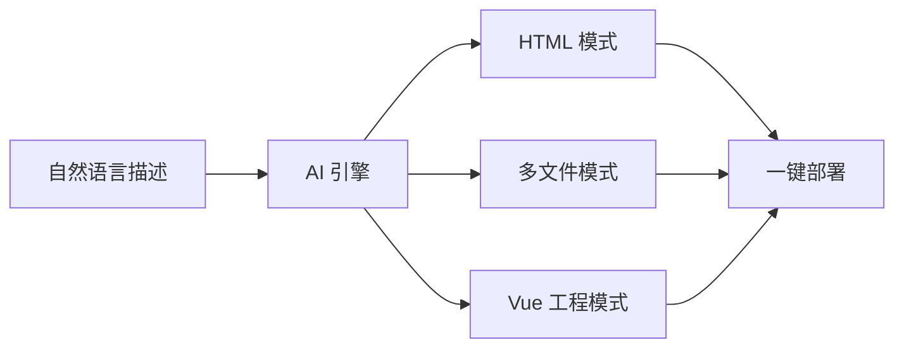
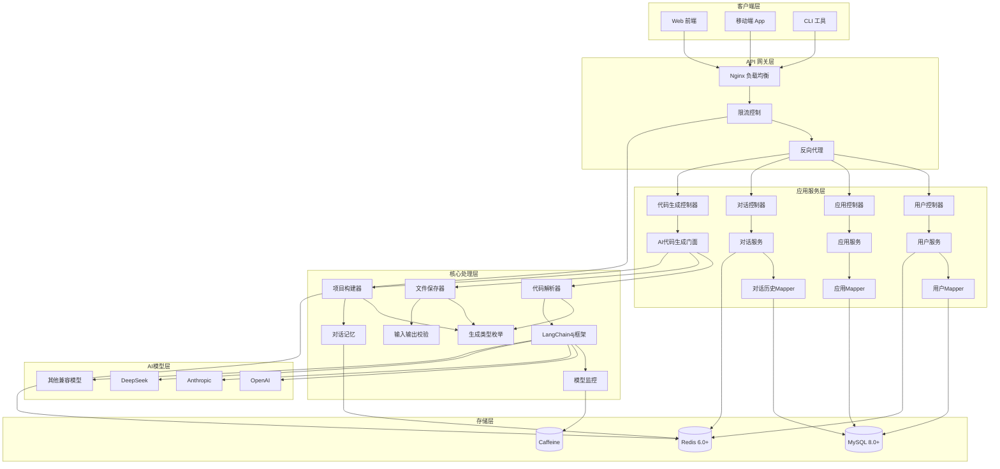

<div align="center">


# 🚀 AI Lowcode

### **用自然语言构建 Web 应用**

[](https://github.com/your-username/ai-lowcode-back)
[](https://github.com/your-username/ai-lowcode-back/network)
[](https://github.com/your-username/ai-lowcode-back/issues)

[功能特性](#-核心功能) • [快速开始](#-快速开始) • [技术架构](#-技术架构) • [API文档](#-api文档) • [贡献指南](#-贡献指南)

</div>

---

## ✨ 项目简介

**AI Lowcode** 是一款低代码平台，通过深度融合 **LLM** 能力，让用户能够使用**自然语言**快速生成生产级的 Web 应用代码。

### 🎯 设计理念

> *"让每个人都能成为开发者"*

我们相信，未来的软件开发不应该被编程语言的门槛所限制。通过 AI 的力量，我们致力于将开发效率提升 **10 倍**，让创意能够瞬间转化为现实。

### 💎 核心亮点

| 特性 | 描述 |
|:---:|:---|
| 🎨 **多模式生成** | 支持 HTML 单页、多文件项目、Vue 工程三种生成模式 |
| ⚡ **流式响应** | 基于 Reactor 实现毫秒级流式输出，实时展现生成过程 |
| 🧠 **对话记忆** | Redis 持久化对话上下文，支持多轮连续对话 |
| 🛡️ **智能限流** | Redisson 分布式限流，保障系统稳定性 |
| 📊 **可观测性** | Prometheus + Grafana 全方位监控体系 |
| 🚀 **一键部署** | 自动化部署流程，秒级发布应用 |

---

## 📦 核心功能

### 🎨 代码生成引擎

<div align="center">



</div>

<details>
<summary><b>📄 HTML 模式</b></summary>

生成单页 HTML 应用，所有样式和脚本内联，适合快速原型开发。

</details>

<details>
<summary><b>📁 多文件模式</b></summary>

生成完整的 HTML/CSS/JS 多文件项目结构，代码分离清晰。

</details>

<details>
<summary><b>🔧 Vue 工程模式</b></summary>

生成基于 Vue 3 + Vite 的完整工程化项目，支持组件化开发。

</details>

---

### 👤 用户管理系统

- ✅ 用户注册 / 登录 / 注销
- 🔐 Session 身份认证（Redis存储）
- 👥 AOP+注解鉴权
- 📝 用户信息管理

---

### 🗂️ 应用管理

- ➕ 创建 / 编辑 / 删除应用
- 🎯 自定义初始化 Prompt
- 🔑 部署标识（deployKey）管理
- 📊 应用优先级控制

---

### 💬 对话管理

- 💾 对话历史持久化存储
- 🧠 基于 Redis 的 Chat Memory
- 📄 游标分页查询支持
- 🔄 上下文连续对话

---

### 📈 系统监控

| 指标 | 说明 |
|:---|:---|
| 📊 **请求统计** | AI 模型调用次数、成功率 |
| 🔢 **Token 监控** | 输入/输出/总 Token 消耗 |
| ⏱️ **性能分析** | P50/P95/P99 响应时间分布 |
| 💰 **成本分析** | 按用户/应用/时间维度的成本分摊 |

---

## 🛠️ 技术架构

### 后端框架

<div align="center">


</div>

### AI 集成

<div align="center">


</div>

### 数据存储

<div align="center">


</div>

### 工具与监控

<div align="center">


</div>

---

## 🚀 快速开始

### 环境要求

| 组件 | 版本要求 |
|:---|:---|
| JDK | **21+** |
| Maven | **3.8+** |
| MySQL | **8.0+** |
| Redis | **6.0+** |
| Node.js | **18+**（可选） |

---

### 安装步骤

#### 1️⃣ 克隆仓库

```bash
git clone https://github.com/your-username/ai-lowcode-back.git
cd ai-lowcode-back
```

#### 2️⃣ 初始化数据库

```bash
# 创建数据库
mysql -u root -p -e "CREATE DATABASE `ai-lowcode` CHARACTER SET utf8mb4 COLLATE utf8mb4_unicode_ci;"

# 导入表结构
mysql -u root -p ai-lowcode < sql/create_tale.sql
```

#### 3️⃣ 配置应用

编辑 `src/main/resources/application.yaml`：

```yaml
spring:
  datasource:
    url: jdbc:mysql://localhost:3306/ai-lowcode
    username: your_username
    password: your_password
  data:
    redis:
      host: localhost
      port: 6379
      password: your_redis_password
```

#### 4️⃣ 配置 AI 模型

创建 `src/main/resources/application-local.yaml`：

```yaml
langchain4j:
  open-ai:
    chat-model:
      base-url: https://api.deepseek.com
      api-key: your-api-key-here
      model-name: deepseek-chat
      temperature: 0.7
      max-tokens: 8192
```

> 💡 **支持模型**：GPT-4、Claude、DeepSeek、通义千问、文心一言等所有兼容 OpenAI API 的模型

#### 5️⃣ 构建并启动

```bash
# 构建
mvn clean install -DskipTests

# 启动
mvn spring-boot:run
```

---

## 📁 项目结构

```
ai-lowcode-back/
├── 📂 docs/                          # 项目文档
│   ├── 📄 应用部署流程.md
│   ├── 📄 对话消息记忆流程.md
│   ├── 📄 打包工具流程.md
│   └── 📄 监控流程.md
├── 📂 sql/                           # 数据库脚本
│   └── 📄 create_tale.sql
├── 📂 src/main/
│   ├── 📂 java/com/hex/ailowcode/
│   │   ├── 📂 annotation/            # 自定义注解
│   │   ├── 📂 aop/                   # AOP 切面
│   │   ├── 📂 ai/                    # AI 核心模块
│   │   │   ├── 📂 guardrail/        # 输入输出校验
│   │   │   ├── 📂 model/            # AI 数据模型
│   │   │   └── 📂 tools/            # AI 工具集
│   │   ├── 📂 common/                # 公共组件
│   │   ├── 📂 config/                # 配置类
│   │   ├── 📂 constant/              # 常量定义
│   │   ├── 📂 controller/            # REST 控制器
│   │   ├── 📂 core/                  # 核心业务
│   │   │   ├── 📂 builder/          # 项目构建器
│   │   │   ├── 📂 parser/           # 代码解析器
│   │   │   └── 📂 saver/            # 文件保存器
│   │   ├── 📂 exception/             # 异常处理
│   │   ├── 📂 generator/             # 代码生成器
│   │   ├── 📂 mapper/                # 数据访问层
│   │   ├── 📂 model/                 # 数据模型
│   │   │   ├── 📂 dto/              # 请求/响应 DTO
│   │   │   ├── 📂 entity/           # 数据库实体
│   │   │   ├── 📂 enums/            # 枚举类型
│   │   │   └── 📂 vo/               # 视图对象
│   │   ├── 📂 monitor/               # 监控模块
│   │   ├── 📂 ratelimiter/           # 限流组件
│   │   ├── 📂 service/               # 业务服务层
│   │   └── 📂 utils/                 # 工具类
│   └── 📂 resources/
│       ├── 📄 application.yaml       # 主配置
│       ├── 📂 mapper/                # MyBatis 映射
│       ├── 📄 nginx.conf             # Nginx 配置
│       └── 📂 prompt/                # AI 提示词模板
├── 📄 pom.xml                        # Maven 配置
└── 📄 README.md                      # 项目文档
```

---

## 🔌 API 文档

### 核心接口

<details>
<summary><b>👤 用户相关</b></summary>

| 接口 | 方法 | 描述 |
|:---|:---:|:---|
| `/api/user/register` | POST | 用户注册 |
| `/api/user/login` | POST | 用户登录 |
| `/api/user/logout` | POST | 用户注销 |
| `/api/user/get/login` | GET | 获取当前登录用户 |
| `/api/user/update` | POST | 更新用户信息 |

</details>

<details>
<summary><b>🗂️ 应用相关</b></summary>

| 接口 | 方法 | 描述 |
|:---|:---:|:---|
| `/api/app/add` | POST | 创建应用 |
| `/api/app/update` | POST | 更新应用 |
| `/api/app/delete` | POST | 删除应用 |
| `/api/app/get` | GET | 获取应用详情 |
| `/api/app/list/page` | GET | 分页获取应用列表 |
| `/api/app/generate` | POST | 生成代码（流式） |
| `/api/app/deploy` | POST | 部署应用 |

</details>

<details>
<summary><b>💬 对话相关</b></summary>

| 接口 | 方法 | 描述 |
|:---|:---:|:---|
| `/api/chat/history/list` | GET | 获取对话历史 |
| `/api/chat/history/page` | GET | 分页获取对话历史 |

</details>

> 📖 **完整文档**：启动项目后访问 [Knife4j 在线文档](http://localhost:8123/api/doc.html)

---

## ⚙️ 配置说明

### 应用配置

```yaml
server:
  port: 8123
  servlet:
    context-path: /api
    session:
      cookie:
        max-age: 2592000  # 30 天

spring:
  session:
    store-type: redis
    timeout: 2592000
```

### 代码输出配置

```yaml
app:
  code:
    output-dir: tmp/code_output    # AI 生成代码存储
    deploy-dir: tmp/code_deploy    # 应用部署目录
    deploy-host: http://localhost  # 部署访问地址
```

### 限流配置

```java
@RateLimit(key = "generate", time = 60, count = 10)
public Flux<String> generateCode(String prompt) {
    // 每分钟最多 10 次请求
}
```

---

## 📊 监控部署

### Prometheus 配置

```yaml
scrape_configs:
  - job_name: 'ai-lowcode'
    metrics_path: '/api/actuator/prometheus'
    scrape_interval: 15s
    static_configs:
      - targets: ['localhost:8123']
```

### Grafana 看板

导入 `docs/ai_model_grafana_config.json` 获取完整监控看板。

#### 监控指标

| 指标 | 类型 | 描述 |
|:---|:---:|:---|
| `ai_model_requests_total` | Counter | AI 模型请求总数 |
| `ai_model_tokens_total` | Counter | Token 消耗总数 |
| `ai_model_response_duration_seconds` | Summary | 响应时间分布 |

---

## 🏗️ 架构设计

### 系统架构图



### 核心模块说明

| 模块 | 功能 | 技术栈 |
|:---|:---|:---|
| **客户端层** | 用户交互界面 | HTML5, React/Vue, Mobile App |
| **API 网关层** | 负载均衡、限流、路由 | Nginx, Spring Cloud Gateway |
| **应用服务层** | 业务逻辑处理 | Spring Boot, MyBatis Flex |
| **核心处理层** | 代码生成、AI处理 | LangChain4j, Reactor |
| **存储层** | 数据持久化 | MySQL, Redis, Caffeine |
| **AI 模型层** | 大语言模型服务 | OpenAI API, Claude, DeepSeek |

### 设计模式应用

| 模式 | 应用场景 | 实现位置 |
|:---|:---|:---|
| **门面模式** | 统一代码生成入口 | `AiCodeGeneratorFacade` |
| **工厂模式** | 按类型创建服务实例 | `AiCodeGeneratorServiceFactory` |
| **策略模式** | 多种代码生成策略 | `CodeParser` / `CodeFileSaver` |
| **模板方法** | 定义保存流程骨架 | `CodeFileSaverTemplate` |

---

### 代码规范

- 遵循 [Alibaba Java Coding Guidelines](https://github.com/alibaba/p3c)
- 使用 UTF-8 编码
- 必须添加单元测试
- 更新相关文档

---

## 💡 项目思考

### 🤔 **为什么要做这个项目？**

<details>
<summary><b>项目背景与价值</b></summary>

**降低开发门槛， democratize software development**

1. **行业痛点**：
   - 传统软件开发需要专业的编程技能
   - 小企业和个人开发者难以承担高昂的开发成本
   - 产品迭代周期长，响应市场慢

2. **解决方案**：
   - 通过自然语言描述即可生成生产级代码
   - 支持多种前端框架（HTML、多文件、Vue）
   - 将开发效率提升10倍以上

3. **商业价值**：
   - 帮助非技术人员快速构建应用原型
   - 为中小企业提供数字化转型工具
   - 减少对昂贵开发团队的依赖

</details>

### 🚧 **项目的难点在哪？**

<details>
<summary><b>技术挑战与突破</b></summary>

**1. AI 模型的可靠性与准确性**
- **挑战**：大语言模型可能生成不完整或有错误的代码
- **解决方案**：
  - 实现多轮对话和上下文记忆
  - 添加 Guardrail 机制进行输入输出校验
  - 支持多种生成模式，提高成功率

**2. 代码质量与工程化**
- **挑战**：生成代码需要符合工程标准
- **解决方案**：
  - 设计代码解析器（CodeParser）和保存器（CodeFileSaver）
  - 实现模板化的项目构建流程
  - 支持Vue工程化项目生成

**3. 系统性能与稳定性**
- **挑战**：AI服务调用耗时长，需要支持高并发
- **解决方案**：
  - 基于Reactor实现流式响应，实时展现生成过程
  - Redis分布式限流，保护系统稳定性
  - Prometheus监控体系，实时追踪性能指标

**4. 多模型兼容性**
- **挑战**：不同AI厂商API差异大
- **解决方案**：
  - 基于LangChain4j实现统一接口
  - 支持OpenAI、Claude、DeepSeek等多种模型
  - 可扩展的模型接入机制

</details>

### 📚 **通过这个项目能学习到什么？**

<details>
<summary><b>技术收获与成长</b></summary>

**1. 架构设计能力**
- **微服务架构**：分层设计，高内聚低耦合
- **设计模式**：门面模式、工厂模式、策略模式、模板方法
- **可扩展性**：插件化的代码生成引擎

**2. AI应用开发**
- **LangChain4j框架**：大语言模型应用开发
- **提示词工程**：设计有效的AI提示词
- **模型监控**：追踪AI模型的使用情况、Token消耗、响应时间

**3. 高并发与性能优化**
- **响应式编程**：Spring WebFlux + Reactor
- **分布式缓存**：Redis Session存储、限流、对话记忆
- **性能监控**：Prometheus + Grafana监控体系

**4. 工程化实践**
- **代码质量**：遵循阿里巴巴Java开发规范
- **测试驱动**：单元测试覆盖核心逻辑
- **CI/CD**：自动化构建与部署

**5. 业务理解能力**
- **用户需求分析**：理解非技术用户的真实需求
- **产品设计**：平衡技术可行性与用户体验
- **技术选型**：根据场景选择合适的技术栈

**6. 项目管理**
- **敏捷开发**：快速迭代，持续交付
- **技术调研**：调研多种AI模型的优缺点
- **风险控制**：限流、监控、降级策略

</details>

---
### Commit 规范

遵循 [Conventional Commits](https://www.conventionalcommits.org/) 规范：

- `feat:` 新功能
- `fix:` 修复问题
- `docs:` 文档更新
- `style:` 代码格式
- `refactor:` 代码重构
- `test:` 测试相关
- `chore:` 构建/工具相关

### 📄 许可证

本项目采用 [MIT](LICENSE) 许可证开源。


<div align="center">


## ⭐ Star History

[](https://star-history.com/#your-username/ai-lowcode-back&Date)

---

**如果这个项目对你有帮助，请给一个 Star ⭐**

Made with ❤️ by [Your Name]

</div>