<div align="center">


# 🚀 AI Lowcode Backend

### **用自然语言构建 Web 应用的智能后端服务**

[](https://github.com/your-username/ai-lowcode-back)
[](https://github.com/your-username/ai-lowcode-back/network)
[](https://github.com/your-username/ai-lowcode-back/issues)

[功能特性](#-核心功能) • [快速开始](#-快速开始) • [技术架构](#-技术架构) • [API文档](#-api文档) • [贡献指南](#-贡献指南)

</div>

---

## ✨ 项目简介

**AI Lowcode** 是一款革命性的低代码平台后端服务，通过深度融合 **大语言模型（LLM）** 能力，让用户能够使用**自然语言**快速生成生产级的 Web 应用代码。

### 🎯 设计理念

> *"让每个人都能成为开发者"*

我们相信，未来的软件开发不应该被编程语言的门槛所限制。通过 AI 的力量，我们致力于将开发效率提升 **10 倍**，让创意能够瞬间转化为现实。

### 💎 核心亮点

| 特性 | 描述 |
|:---:|:---|
| 🎨 **多模式生成** | 支持 HTML 单页、多文件项目、Vue 工程三种生成模式 |
| ⚡ **流式响应** | 基于 Reactor 实现毫秒级流式输出，实时展现生成过程 |
| 🧠 **对话记忆** | Redis 持久化对话上下文，支持多轮连续对话 |
| 🛡️ **智能限流** | Redisson 分布式限流，保障系统稳定性 |
| 📊 **可观测性** | Prometheus + Grafana 全方位监控体系 |
| 🚀 **一键部署** | 自动化部署流程，秒级发布应用 |

---

## 📦 核心功能

### 🎨 代码生成引擎

```mermaid
graph LR
    A[自然语言描述] --> B[AI 引擎]
    B --> C[HTML 模式]
    B --> D[多文件模式]
    B --> E[Vue 工程模式]
    C --> F[一键部署]
    D --> F
    E --> F
```

<div align="center">



</div>

<details>
<summary><b>📄 HTML 模式</b></summary>

生成单页 HTML 应用，所有样式和脚本内联，适合快速原型开发。

</details>

<details>
<summary><b>📁 多文件模式</b></summary>

生成完整的 HTML/CSS/JS 多文件项目结构，代码分离清晰。

</details>

<details>
<summary><b>🔧 Vue 工程模式</b></summary>

生成基于 Vue 3 + Vite 的完整工程化项目，支持组件化开发。

</details>

---

### 👤 用户管理系统

- ✅ 用户注册 / 登录 / 注销
- 🔐 Session 身份认证（Redis存储）
- 👥 AOP+注解鉴权
- 📝 用户信息管理

---

### 🗂️ 应用管理

- ➕ 创建 / 编辑 / 删除应用
- 🎯 自定义初始化 Prompt
- 🔑 部署标识（deployKey）管理
- 📊 应用优先级控制

---

### 💬 对话管理

- 💾 对话历史持久化存储
- 🧠 基于 Redis 的 Chat Memory
- 📄 游标分页查询支持
- 🔄 上下文连续对话

---

### 📈 系统监控

| 指标 | 说明 |
|:---|:---|
| 📊 **请求统计** | AI 模型调用次数、成功率 |
| 🔢 **Token 监控** | 输入/输出/总 Token 消耗 |
| ⏱️ **性能分析** | P50/P95/P99 响应时间分布 |
| 💰 **成本分析** | 按用户/应用/时间维度的成本分摊 |

---

## 🛠️ 技术架构

### 后端框架

<div align="center">


</div>

### AI 集成

<div align="center">


</div>

### 数据存储

<div align="center">


</div>

### 工具与监控

<div align="center">


</div>

---

## 🚀 快速开始

### 环境要求

| 组件 | 版本要求 |
|:---|:---|
| JDK | **21+** |
| Maven | **3.8+** |
| MySQL | **8.0+** |
| Redis | **6.0+** |
| Node.js | **18+**（可选） |

---

### 安装步骤

#### 1️⃣ 克隆仓库

```bash
git clone https://github.com/your-username/ai-lowcode-back.git
cd ai-lowcode-back
```

#### 2️⃣ 初始化数据库

```bash
# 创建数据库
mysql -u root -p -e "CREATE DATABASE `ai-lowcode` CHARACTER SET utf8mb4 COLLATE utf8mb4_unicode_ci;"

# 导入表结构
mysql -u root -p ai-lowcode < sql/create_tale.sql
```

#### 3️⃣ 配置应用

编辑 `src/main/resources/application.yaml`：

```yaml
spring:
  datasource:
    url: jdbc:mysql://localhost:3306/ai-lowcode
    username: your_username
    password: your_password
  data:
    redis:
      host: localhost
      port: 6379
      password: your_redis_password
```

#### 4️⃣ 配置 AI 模型

创建 `src/main/resources/application-local.yaml`：

```yaml
langchain4j:
  open-ai:
    chat-model:
      base-url: https://api.deepseek.com
      api-key: your-api-key-here
      model-name: deepseek-chat
      temperature: 0.7
      max-tokens: 8192
```

> 💡 **支持模型**：GPT-4、Claude、DeepSeek、通义千问、文心一言等所有兼容 OpenAI API 的模型

#### 5️⃣ 构建并启动

```bash
# 构建
mvn clean install -DskipTests

# 启动
mvn spring-boot:run
```

#### 6️⃣ 访问服务

| 服务 | 地址 |
|:---|:---|
| API 端点 | http://localhost:8123/api |
| API 文档 | http://localhost:8123/api/doc.html |
| 健康检查 | http://localhost:8123/api/actuator/health |

---

## 📁 项目结构

```
ai-lowcode-back/
├── 📂 docs/                          # 项目文档
│   ├── 📄 应用部署流程.md
│   ├── 📄 对话消息记忆流程.md
│   ├── 📄 打包工具流程.md
│   └── 📄 监控流程.md
├── 📂 sql/                           # 数据库脚本
│   └── 📄 create_tale.sql
├── 📂 src/main/
│   ├── 📂 java/com/hex/ailowcode/
│   │   ├── 📂 annotation/            # 自定义注解
│   │   ├── 📂 aop/                   # AOP 切面
│   │   ├── 📂 ai/                    # AI 核心模块
│   │   │   ├── 📂 guardrail/        # 输入输出校验
│   │   │   ├── 📂 model/            # AI 数据模型
│   │   │   └── 📂 tools/            # AI 工具集
│   │   ├── 📂 common/                # 公共组件
│   │   ├── 📂 config/                # 配置类
│   │   ├── 📂 constant/              # 常量定义
│   │   ├── 📂 controller/            # REST 控制器
│   │   ├── 📂 core/                  # 核心业务
│   │   │   ├── 📂 builder/          # 项目构建器
│   │   │   ├── 📂 parser/           # 代码解析器
│   │   │   └── 📂 saver/            # 文件保存器
│   │   ├── 📂 exception/             # 异常处理
│   │   ├── 📂 generator/             # 代码生成器
│   │   ├── 📂 mapper/                # 数据访问层
│   │   ├── 📂 model/                 # 数据模型
│   │   │   ├── 📂 dto/              # 请求/响应 DTO
│   │   │   ├── 📂 entity/           # 数据库实体
│   │   │   ├── 📂 enums/            # 枚举类型
│   │   │   └── 📂 vo/               # 视图对象
│   │   ├── 📂 monitor/               # 监控模块
│   │   ├── 📂 ratelimiter/           # 限流组件
│   │   ├── 📂 service/               # 业务服务层
│   │   └── 📂 utils/                 # 工具类
│   └── 📂 resources/
│       ├── 📄 application.yaml       # 主配置
│       ├── 📂 mapper/                # MyBatis 映射
│       ├── 📄 nginx.conf             # Nginx 配置
│       └── 📂 prompt/                # AI 提示词模板
├── 📄 pom.xml                        # Maven 配置
└── 📄 README.md                      # 项目文档
```

---

## 🔌 API 文档

### 核心接口

<details>
<summary><b>👤 用户相关</b></summary>

| 接口 | 方法 | 描述 |
|:---|:---:|:---|
| `/api/user/register` | POST | 用户注册 |
| `/api/user/login` | POST | 用户登录 |
| `/api/user/logout` | POST | 用户注销 |
| `/api/user/get/login` | GET | 获取当前登录用户 |
| `/api/user/update` | POST | 更新用户信息 |

</details>

<details>
<summary><b>🗂️ 应用相关</b></summary>

| 接口 | 方法 | 描述 |
|:---|:---:|:---|
| `/api/app/add` | POST | 创建应用 |
| `/api/app/update` | POST | 更新应用 |
| `/api/app/delete` | POST | 删除应用 |
| `/api/app/get` | GET | 获取应用详情 |
| `/api/app/list/page` | GET | 分页获取应用列表 |
| `/api/app/generate` | POST | 生成代码（流式） |
| `/api/app/deploy` | POST | 部署应用 |

</details>

<details>
<summary><b>💬 对话相关</b></summary>

| 接口 | 方法 | 描述 |
|:---|:---:|:---|
| `/api/chat/history/list` | GET | 获取对话历史 |
| `/api/chat/history/page` | GET | 分页获取对话历史 |

</details>

> 📖 **完整文档**：启动项目后访问 [Knife4j 在线文档](http://localhost:8123/api/doc.html)

---

## ⚙️ 配置说明

### 应用配置

```yaml
server:
  port: 8123
  servlet:
    context-path: /api
    session:
      cookie:
        max-age: 2592000  # 30 天

spring:
  session:
    store-type: redis
    timeout: 2592000
```

### 代码输出配置

```yaml
app:
  code:
    output-dir: tmp/code_output    # AI 生成代码存储
    deploy-dir: tmp/code_deploy    # 应用部署目录
    deploy-host: http://localhost  # 部署访问地址
```

### 限流配置

```java
@RateLimit(key = "generate", time = 60, count = 10)
public Flux<String> generateCode(String prompt) {
    // 每分钟最多 10 次请求
}
```

---

## 📊 监控部署

### Prometheus 配置

```yaml
scrape_configs:
  - job_name: 'ai-lowcode'
    metrics_path: '/api/actuator/prometheus'
    scrape_interval: 15s
    static_configs:
      - targets: ['localhost:8123']
```

### Grafana 看板

导入 `docs/ai_model_grafana_config.json` 获取完整监控看板。

#### 监控指标

| 指标 | 类型 | 描述 |
|:---|:---:|:---|
| `ai_model_requests_total` | Counter | AI 模型请求总数 |
| `ai_model_tokens_total` | Counter | Token 消耗总数 |
| `ai_model_response_duration_seconds` | Summary | 响应时间分布 |

---

## 🐳 部署指南

### Docker 部署

```dockerfile
# 构建镜像
docker build -t ai-lowcode:latest .

# 运行容器
docker run -d \
  --name ai-lowcode \
  -p 8123:8123 \
  -e SPRING_DATASOURCE_URL=jdbc:mysql://host.docker.internal:3306/ai-lowcode \
  -e SPRING_DATASOURCE_USERNAME=root \
  -e SPRING_DATASOURCE_PASSWORD=password \
  -e SPRING_REDIS_HOST=host.docker.internal \
  -e SPRING_REDIS_PORT=6379 \
  ai-lowcode:latest
```

### Docker Compose

```yaml
version: '3.8'
services:
  app:
    image: ai-lowcode:latest
    ports:
      - "8123:8123"
    environment:
      - SPRING_DATASOURCE_URL=jdbc:mysql://mysql:3306/ai-lowcode
      - SPRING_REDIS_HOST=redis
    depends_on:
      - mysql
      - redis

  mysql:
    image: mysql:8.0
    environment:
      - MYSQL_DATABASE=ai-lowcode
      - MYSQL_ROOT_PASSWORD=password

  redis:
    image: redis:7-alpine
```

### Nginx 静态服务

```nginx
server {
    listen       80;
    server_name  localhost;

    root         /path/to/tmp/code_deploy;

    location ~ ^/([^/]+)/(.*)$ {
        try_files /$1/$2 /$1/index.html =404;
    }
}
```

---

## 🏗️ 架构设计

### 系统架构图

```
┌─────────────────────────────────────────────────────────────────┐
│                           客户端层                               │
│                    (Web / Mobile / CLI)                         │
└────────────────────────┬────────────────────────────────────────┘
                         │
                         ▼
┌─────────────────────────────────────────────────────────────────┐
│                      API 网关层                                  │
│              (Nginx / 负载均衡 / 限流)                           │
└────────────────────────┬────────────────────────────────────────┘
                         │
                         ▼
┌─────────────────────────────────────────────────────────────────┐
│                    应用服务层 (Spring Boot)                      │
│  ┌──────────────┐  ┌──────────────┐  ┌──────────────┐          │
│  │  Controller  │─▶│    Service   │─▶│    Mapper    │          │
│  └──────────────┘  └──────────────┘  └──────────────┘          │
│         │                                                  │     │
│         ▼                                                  ▼     │
│  ┌──────────────┐                                  ┌──────────┐ │
│  │    Facade    │                                  │ Database │ │
│  └──────────────┘                                  └──────────┘ │
│         │                                                   │   │
│         ▼                                                   ▼   │
│  ┌──────────────┐  ┌──────────────┐  ┌──────────────┐       │
│  │   Parser     │─▶│   Saver      │  │   Monitor    │       │
│  └──────────────┘  └──────────────┘  └──────────────┘       │
└─────────┬─────────────────────────────────────────────────────┘
          │
          ▼
┌─────────────────────────────────────────────────────────────────┐
│                      AI 服务层                                   │
│  ┌──────────────┐  ┌──────────────┐  ┌──────────────┐          │
│  │  LangChain4j │  │  Guardrail   │  │   Chat       │          │
│  │              │  │  (校验)       │  │   Memory     │          │
│  └──────────────┘  └──────────────┘  └──────────────┘          │
└─────────┬───────────────────────────────────────────────────────┘
          │
          ▼
┌─────────────────────────────────────────────────────────────────┐
│                    LLM 提供商                                    │
│         (OpenAI / DeepSeek / Claude / 通义千问 ...)              │
└─────────────────────────────────────────────────────────────────┘
```

### 设计模式应用

| 模式 | 应用场景 | 实现位置 |
|:---|:---|:---|
| **门面模式** | 统一代码生成入口 | `AiCodeGeneratorFacade` |
| **工厂模式** | 按类型创建服务实例 | `AiCodeGeneratorServiceFactory` |
| **策略模式** | 多种代码生成策略 | `CodeParser` / `CodeFileSaver` |
| **模板方法** | 定义保存流程骨架 | `CodeFileSaverTemplate` |

---

## 🧪 开发指南

### 扩展新的代码生成类型

1. 在 `CodeGenTypeEnum` 添加新类型
2. 创建对应的 `CodeParser` 实现类
3. 创建对应的 `CodeFileSaver` 实现类
4. 在 `AiCodeGeneratorService` 中实现生成逻辑
5. 注册到工厂类中

### 运行测试

```bash
# 运行所有测试
mvn test

# 运行指定测试类
mvn test -Dtest=AiCodeGeneratorServiceTest
```

### 代码规范

- 遵循 [Alibaba Java Coding Guidelines](https://github.com/alibaba/p3c)
- 使用 UTF-8 编码
- 必须添加单元测试
- 更新相关文档

---

## ❓ 常见问题

<details>
<summary><b>Q: 支持哪些 AI 模型？</b></summary>

任何兼容 OpenAI API 格式的模型，包括但不限于：
- OpenAI (GPT-4, GPT-4-turbo)
- Anthropic (Claude 3)
- DeepSeek (deepseek-chat, deepseek-coder)
- 阿里云 (通义千问)
- 百度 (文心一言)

</details>

<details>
<summary><b>Q: 如何修改生成代码的存储路径？</b></summary>

修改 `application.yaml` 中的配置：

```yaml
app:
  code:
    output-dir: /your/custom/path
```

</details>

<details>
<summary><b>Q: 如何禁用限流？</b></summary>

移除接口上的 `@RateLimit` 注解即可。

</details>

<details>
<summary><b>Q: 支持分布式部署吗？</b></summary>

支持。系统使用 Redis 实现分布式 Session 和限流，可直接部署多个实例。

</details>

---

## 🗺️ 路线图

- [ ] 🔥 支持更多前端框架（React、Angular、Svelte）
- [ ] 📦 实现代码版本管理
- [ ] 👁️ 添加代码在线预览功能
- [ ] 👥 支持团队协作开发
- [ ] 🎨 提供前端管理界面
- [ ] 🤖 接入更多 AI 模型
- [ ] 📱 支持移动端应用生成
- [ ] 🔌 提供插件系统

---

## 🤝 贡献指南

我们欢迎任何形式的贡献！

### 贡献流程

1. **Fork** 本仓库
2. 创建特性分支 (`git checkout -b feature/AmazingFeature`)
3. 提交更改 (`git commit -m 'feat: add some AmazingFeature'`)
4. 推送到分支 (`git push origin feature/AmazingFeature`)
5. 提交 **Pull Request**

### Commit 规范

遵循 [Conventional Commits](https://www.conventionalcommits.org/) 规范：

- `feat:` 新功能
- `fix:` 修复问题
- `docs:` 文档更新
- `style:` 代码格式
- `refactor:` 代码重构
- `test:` 测试相关
- `chore:` 构建/工具相关

---

## 📄 许可证

本项目采用 [MIT](LICENSE) 许可证开源。

---

## 📮 联系方式

<div align="center">

| 方式 | 链接 |
|:---:|:---|
| 🏠 **项目主页** | [github.com/your-username/ai-lowcode-back](https://github.com/your-username/ai-lowcode-back) |
| 🐛 **问题反馈** | [Issues](https://github.com/your-username/ai-lowcode-back/issues) |
| 💬 **讨论区** | [Discussions](https://github.com/your-username/ai-lowcode-back/discussions) |

---

## ⭐ Star History

[](https://star-history.com/#your-username/ai-lowcode-back&Date)

---

**如果这个项目对你有帮助，请给一个 Star ⭐**

Made with ❤️ by [Your Name]

</div>