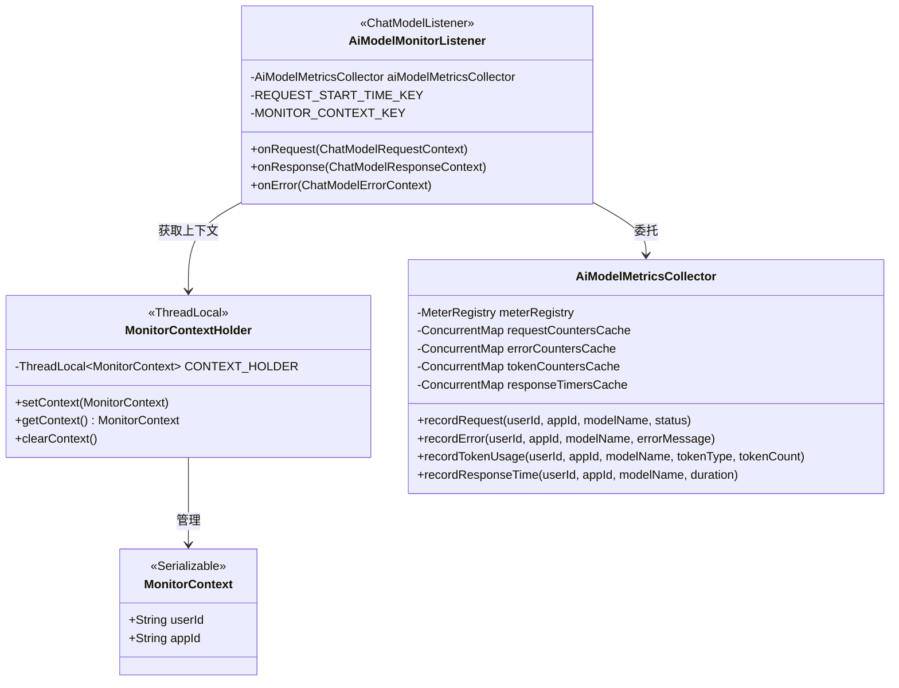
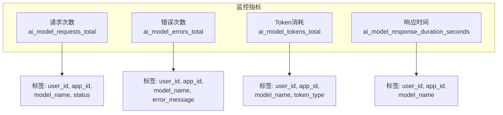
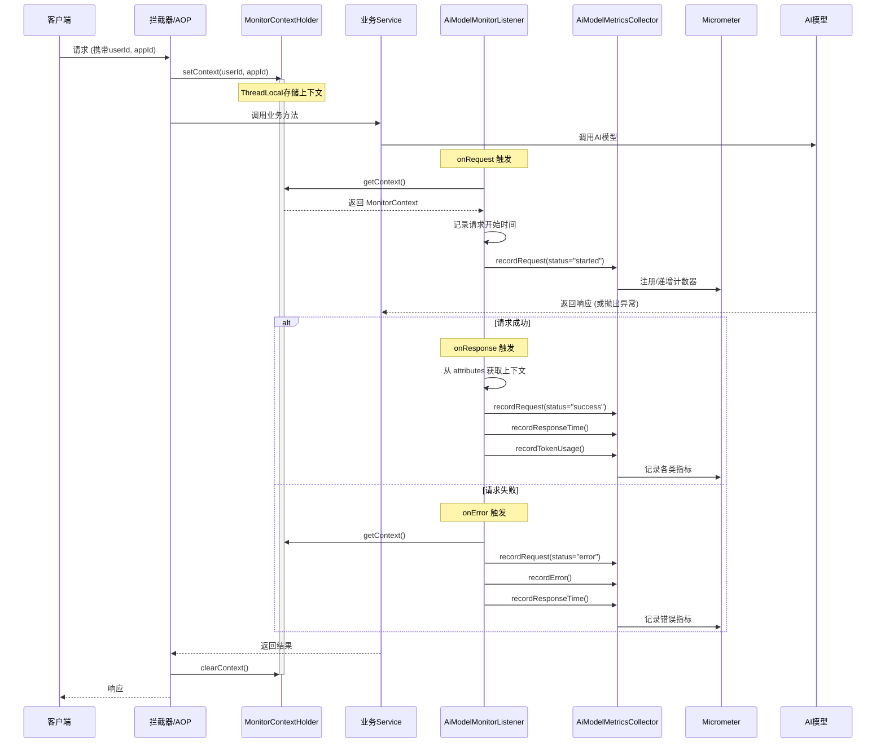
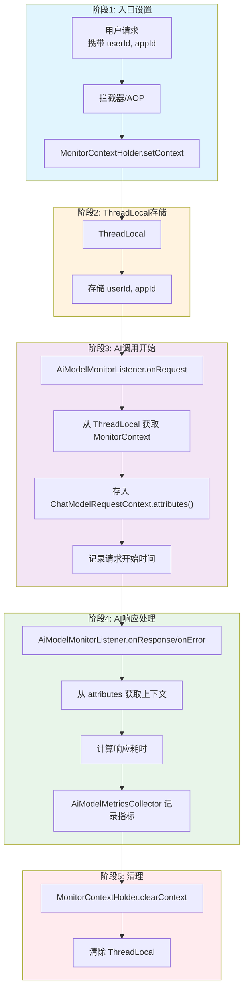
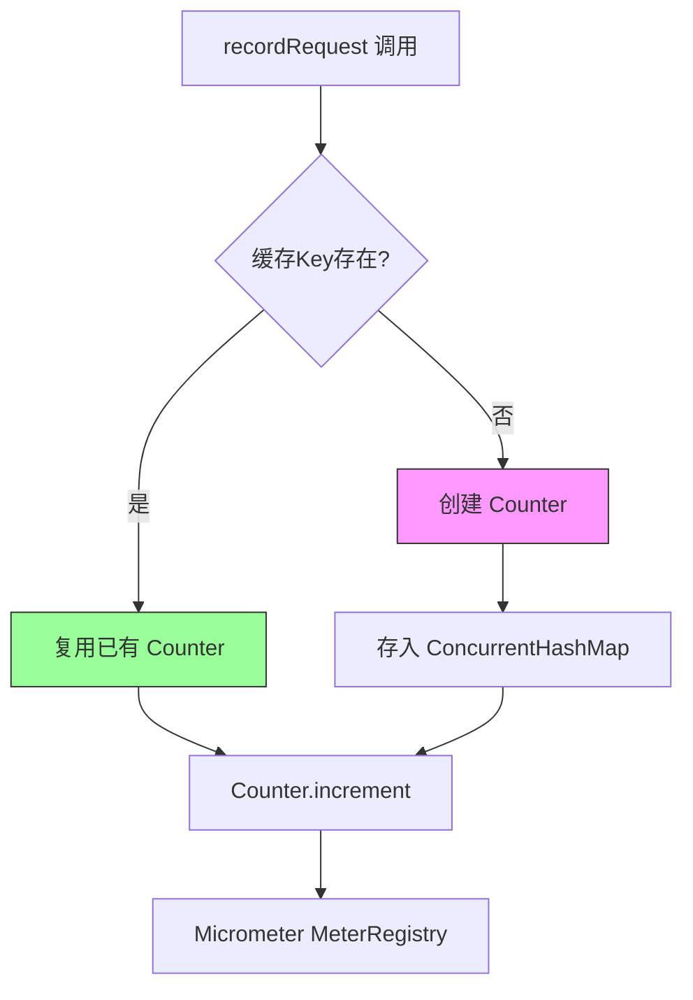

# AI 模型监控功能总结

## 一、概述

monitor 包实现了基于 Micrometer 和 LangChain4j 的 AI 模型监控系统，用于收集和分析 AI 模型调用的各项指标数据。

## 二、核心组件

### 2.1 组件关系图



### 2.2 组件说明

| 组件 | 职责 |
|------|------|
| **MonitorContext** | 监控上下文实体，包含 userId 和 appId 等业务信息 |
| **MonitorContextHolder** | 基于 ThreadLocal 的上下文管理器，在同一线程中传递监控数据 |
| **AiModelMetricsCollector** | 指标收集器，使用 Micrometer 框架注册和记录各类监控指标 |
| **AiModelMonitorListener** | 实现 LangChain4j 的 ChatModelListener 接口，在模型调用各阶段触发指标收集 |

## 三、监控指标

### 3.1 指标体系



### 3.2 指标详情

| 指标名称 | 类型 | 描述 | 标签维度 |
|----------|------|------|----------|
| `ai_model_requests_total` | Counter | AI 模型总请求次数 | user_id, app_id, model_name, status |
| `ai_model_errors_total` | Counter | AI 模型错误次数 | user_id, app_id, model_name, error_message |
| `ai_model_tokens_total` | Counter | AI 模型 Token 消耗总数 | user_id, app_id, model_name, token_type |
| `ai_model_response_duration_seconds` | Timer | AI 模型响应时间 | user_id, app_id, model_name |

## 四、监控流程

### 4.1 完整流程图



### 4.2 上下文传递流程



## 五、数据流转

### 5.1 参数传递机制

```
┌─────────────────────────────────────────────────────────────────────────┐
│                        参数传递流程                                       │
├─────────────────────────────────────────────────────────────────────────┤
│                                                                         │
│  1. 入口: 用户请求携带 userId/appId                                        │
│         ↓                                                               │
│  2. ThreadLocal存储: AOP/拦截器将 userId/appId 存入 MonitorContextHolder   │
│         ↓                                                               │
│  3. onRequest: 从 MonitorContext(ThreadLocal) 取出 userId/appId,         │
│                存入 ChatModelRequestContext.attributes()                 │
│         ↓                                                               │
│  4. onResponse: 从 ChatModelResponseContext.attributes() 取出数据,        │
│                计算耗时并记录指标                                           │
│                                                                         │
└─────────────────────────────────────────────────────────────────────────┘
```

### 5.2 两个上下文概念

| 上下文类型 | 来源 | 用途 | 生命周期 |
|-----------|------|------|----------|
| **ChatModelRequestContext/ResponseContext** | LangChain4j | 在 onRequest/onResponse/onError 之间传递数据 | 单次模型调用 |
| **MonitorContext** | 自定义 | 包含 userId、appId 等业务信息 | 单次 HTTP 请求 |

## 六、性能优化

### 6.1 指标缓存机制



### 6.2 缓存策略

- 使用 `ConcurrentHashMap` 缓存已创建的指标对象
- 通过 `computeIfAbsent` 方法实现原子性的"检查-创建"操作
- 避免重复注册相同维度的指标，提升性能

## 七、关键代码位置

| 文件 | 行号 | 说明 |
|------|------|------|
| `MonitorContext.java` | 全部 | 监控上下文实体 |
| `MonitorContextHolder.java` | 22-43 | ThreadLocal 上下文管理 |
| `AiModelMetricsCollector.java` | 48-60 | 请求次数记录 |
| `AiModelMetricsCollector.java` | 71-83 | 错误次数记录 |
| `AiModelMetricsCollector.java` | 94-107 | Token 消耗记录 |
| `AiModelMetricsCollector.java` | 119-130 | 响应时间记录 |
| `AiModelMonitorListener.java` | 50-62 | onRequest 处理 |
| `AiModelMonitorListener.java` | 65-80 | onResponse 处理 |
| `AiModelMonitorListener.java` | 83-97 | onError 处理 |